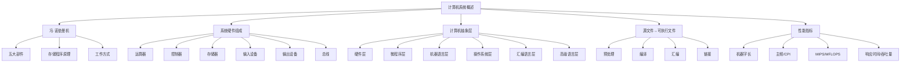
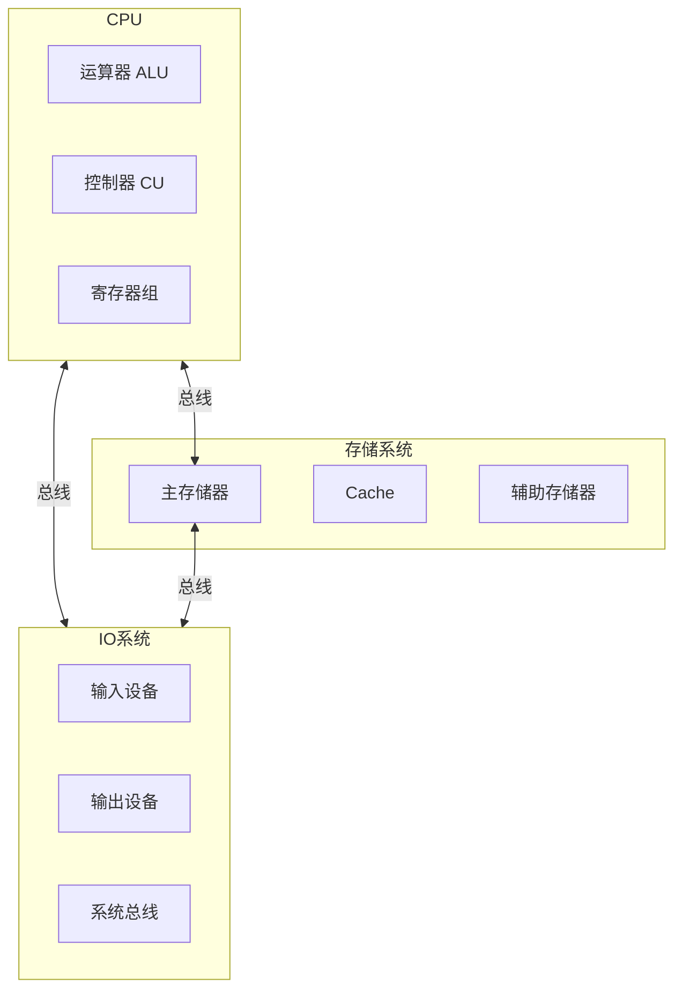

# 计算机系统概述

#408 #计算机组成原理 #思维导图

---

## 思维导图总览



---

## 一、冯·诺依曼机


### 1.1 核心思想

| 要点 | 内容 |
| :--- | :--- |
| **存储程序** | 指令和数据以同等地位存储在存储器中，按地址访问 |
| **指令驱动** | 按地址顺序逐条取出指令 → 译码 → 执行，周而复始 |
| **五大部件** | 运算器、控制器、存储器、输入设备、输出设备 |
| **二进制编码** | 指令和数据均用二进制表示 |

### 1.2 工作流程

```
取指令(Fetch) → 译码(Decode) → 执行(Execute) → 取下一条指令
```

- **取指阶段**：PC → MAR → 存储器 → MDR → IR
- **执行阶段**：控制器产生控制信号 → 运算器运算 → 结果写回

### 1.3 与现代计算机的差异

| 冯·诺依曼机 | 现代计算机 |
| :--- | :--- |
| 以运算器为中心 | **以存储器为中心** |
| CPU 与存储器直接交互 | 通过总线/缓存层次交互 |
| 串行执行 | 流水线/超标量/多核 |

---

## 二、系统硬件组成

### 2.1 五大部件详解



#### 运算器（ALU + 寄存器组）

| 部件 | 功能 |
| :--- | :--- |
| **ALU**（算术逻辑单元） | 算术运算、逻辑运算、移位 |
| **ACC**（累加器） | 存放操作数或运算结果 |
| **MQ**（乘商寄存器） | 乘除法专用 |
| **X**（操作数寄存器） | 暂存操作数 |
| **PSW**（程序状态字） | 标志位：ZF/CF/OF/SF |

#### 控制器

| 部件 | 功能 |
| :--- | :--- |
| **PC**（程序计数器） | 存放下一条指令地址 |
| **IR**（指令寄存器） | 存放当前执行的指令 |
| **ID**（指令译码器） | 对 IR 中的操作码译码 |
| **MAR**（存储器地址寄存器） | 存放访问内存的地址 |
| **MDR**（存储器数据寄存器） | 存放与内存交换的数据 |
| **CU**（控制单元） | 产生控制信号序列 |
| **时序发生器** | 产生时钟节拍 |

#### 存储器

| 层次 | 组成 | 特点 |
| :--- | :--- | :--- |
| **寄存器** | CPU 内部 | 最快、容量最小 |
| **Cache** | SRAM | 高速缓冲，缓解 CPU-内存速度差 |
| **主存** | DRAM | 存放运行中的程序和数据 |
| **辅存** | 硬盘/SSD | 容量大、非易失 |

#### 总线

| 类型 | 功能 |
| :--- | :--- |
| **数据总线** | 传输数据（双向） |
| **地址总线** | 传输地址（单向，CPU→外设） |
| **控制总线** | 传输控制/状态信号 |

> ⚠️ **总线宽度**：数据总线宽度通常等于机器字长；地址总线宽度决定可寻址空间大小。

---

## 三、计算机抽象层

```
┌──────────────────────────┐  ← 用户
│   L6: 高级语言层（C/Java） │
├──────────────────────────┤
│   L5: 汇编语言层          │
├──────────────────────────┤
│   L4: 操作系统层          │
├──────────────────────────┤
│   L3: 指令集架构层（ISA）  │  ← 软硬件分界线
├──────────────────────────┤
│   L2: 微程序层            │
├──────────────────────────┤
│   L1: 数字逻辑层          │
└──────────────────────────┘  ← 物理硬件
```

| 层次 | 名称 | 核心概念 | 408 考点关联 |
| :--- | :--- | :--- | :--- |
| L1 | 数字逻辑层 | 门电路、触发器、组合/时序逻辑 | —（数字电路基础） |
| L2 | 微程序层 | 微指令、微操作序列 | 微程序控制器 |
| **L3** | **ISA 层** | **指令集、寄存器、寻址方式、数据通路** | **计组核心分界线** |
| L4 | 操作系统层 | 进程管理、内存管理、文件系统 | 操作系统 |
| L5 | 汇编语言层 | 助记符、伪指令、宏 | 指令系统 |
| L6 | 高级语言层 | 编译器、解释器 | 编译原理基础 |

> **ISA（指令集体系结构）**是软件与硬件的**分界线**：之上为软件世界，之下为硬件实现。同一 ISA 可有不同的硬件实现（微程序/硬布线）。

---

## 四、从源文件到可执行文件

```
hello.c ──[预处理器]──> hello.i ──[编译器]──> hello.s ──[汇编器]──> hello.o ──[链接器]──> hello.exe
(源程序)    (cpp)      (预处理后)    (cc1)    (汇编程序)    (as)     (目标模块)    (ld)      (可执行文件)
```

### 4.1 四阶段详解

| 阶段 | 输入 | 输出 | 执行程序 | 主要工作 |
| :--- | :--- | :--- | :--- | :--- |
| **预处理** | `.c` | `.i` | cpp | 宏展开、头文件包含、条件编译、删注释 |
| **编译** | `.i` | `.s` | cc1 / clang | 词法分析→语法分析→语义分析→中间代码→优化→汇编代码 |
| **汇编** | `.s` | `.o` | as | 将汇编指令翻译成机器码，生成**可重定位目标文件** |
| **链接** | `.o` + `.a/.lib` | `.exe`（可执行） | ld | 符号解析 + 重定位，将多个目标模块合并为可执行文件 |

### 4.2 链接的两种方式

| 类型 | 时机 | 特点 |
| :--- | :--- | :--- |
| **静态链接** | 编译时 | 库代码直接复制到可执行文件，文件大但独立运行 |
| **动态链接** | 运行时（加载时/运行时） | 库代码不复制，多个程序共享，节省内存和磁盘 |

### 4.3 目标文件格式（ELF）

| 段 | 内容 |
| :--- | :--- |
| `.text` | 机器指令代码 |
| `.rodata` | 只读数据（常量、字符串字面量） |
| `.data` | 已初始化的全局/静态变量 |
| `.bss` | 未初始化的全局/静态变量（不占磁盘空间） |
| `.symtab` | 符号表（函数名、全局变量名等） |
| `.rel.text` | `.text` 段的重定位信息 |
| `.rel.data` | `.data` 段的重定位信息 |

---

## 五、性能指标

### 5.1 基本指标

| 指标 | 符号/公式 | 说明 |
| :--- | :--- | :--- |
| **机器字长** | — | CPU 一次处理数据的位数（32/64位），标志计算精度 |
| **主频** | $f$（Hz） | CPU 时钟频率，$T = 1/f$ 为时钟周期 |
| **CPI** | — | 执行一条指令平均所需时钟周期数（Cycles Per Instruction） |
| **IPC** | $1/\text{CPI}$ | 每周期平均执行指令数 |
| **MIPS** | $\frac{f}{\text{CPI} \times 10^6}$ | 每秒百万条指令（Millions of Instructions Per Second） |
| **MFLOPS** | — | 每秒百万次浮点运算 |
| **响应时间** | $T_{\text{resp}}$ | 从任务开始到结束的总时间（**用户感知**） |
| **吞吐量** | — | 单位时间内完成的任务数（**系统视角**） |

### 5.2 CPU 执行时间

$$
\text{CPU执行时间} = \text{指令数} \times \text{CPI} \times \text{时钟周期}
$$

即：

$$
T_{\text{CPU}} = \frac{N \times \text{CPI}}{f}
$$

> 三个核心因素：**指令数（编译器决定）** × **CPI（ISA 和微架构决定）** × **时钟周期（工艺和微架构决定）**

### 5.3 性能比较

| 度量方式 | 公式 | 说明 |
| :--- | :--- | :--- |
| **加速比** | $S = T_{\text{old}} / T_{\text{new}}$ | 改进后性能是原来的 $S$ 倍 |
| **Amdahl 定律** | $S = \frac{1}{(1-\alpha) + \alpha/k}$ | $\alpha$：可改进部分占比，$k$：改进部分的加速比 |
| **CPU 时间** | $\sum (N_i \times \text{CPI}_i) \times T$ | 按指令类型加权平均 |

### 5.4 常用基准测试

| 测试集 | 面向领域 | 指标 |
| :--- | :--- | :--- |
| **SPEC CPU** | CPU 密集型（整数/浮点） | SPECratio |
| **SPEC Power** | 服务器能效 | 性能/功耗 |
| **TPC** | 数据库事务处理 | 每分钟事务数 |

---

## 六、408 常考点

| 考点 | 考察方式 | 频率 |
| :--- | :--- | :---: |
| 冯·诺依曼机工作方式 | 选择题——部件功能识别 | ★★★ |
| CPU 内部寄存器（PC/IR/MAR/MDR） | 选择题——给定场景判断寄存器内容 | ★★★ |
| 性能指标计算（CPI/MIPS/执行时间） | 计算题——多程序段加权平均 | ★★★★★ |
| 从源文件到可执行文件的各阶段 | 选择题——阶段功能/产物匹配 | ★★ |
| 计算机层次结构 / ISA 分界 | 概念题 | ★★ |
| 总线的分类与功能 | 选择题 | ★ |

---

## 七、易错点

> ⚠️ **MAR 与 MDR 的位置**：MAR 和 MDR 在物理上可能位于 CPU 内部（现代设计），但逻辑上属于存储器接口。408 考试以**逻辑功能**归类为准。
>
> ⚠️ **CPI 不是固定值**：不同指令类型的 CPI 不同（访存指令 > 运算指令），计算平均 CPI 需按指令比例加权。
>
> ⚠️ **机器字长 vs 存储字长**：机器字长 = CPU 一次处理位数；存储字长 = 一个存储单元存放的位数。二者通常相等，但不必然。
>
> ⚠️ **MIPS 的误导性**：同一程序在不同 ISA 上指令数不同，MIPS 不能跨 ISA 对比。
>
> ⚠️ **PC 的更新时机**：取指阶段末尾 PC 自动 +1（或 + 偏移），而非执行完毕后。

---

📥 *后续预告：数据表示与运算 / 存储系统层次结构*
