# 408 计算机统考 — 全面分析报告

> 数据管道: `习题册.xlsx` → `export_xlsx_to_csv.py` → `analyze_csv_folder.py` → `visualize_408.py`

> 生成时间：2026-06-16

## 一、四科总览

| 科目 | 题量 | 正确数 | 正确率 | 已做章节 | 已做小节 | 状态 |
|:---|:---:|:---:|:---:|:---:|:---:|:---|
| **数据结构** | 595 | 508 | 85.4% | 8 | 28 | 一刷完成 |
| **计算机组成原理** | 592 | 437 | 73.8% | 7 | 26 | 一刷完成 |
| **操作系统** | 650 | 484 | 74.5% | 5 | 16 | 一刷完成 |
| 计算机网络 | — | — | 未开始 | — | — | 待开始 |

**三科合计**：1429/1837 = **77.8%**，408 估分约 **117 分**（满分 150）

> 估分方式：章节正确率 × 150 直接折算。实际真题难度通常高于章节练习，得分可能略低 5-10 分。

## 二、真题 vs 自编 章节对比

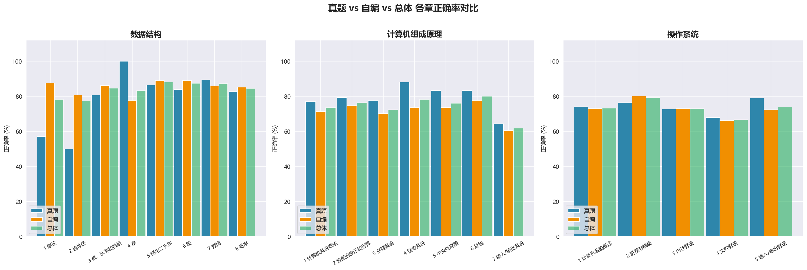

### 数据结构

| 章节 | 真题率 | 自编率 | 差距 | 诊断 |
|:---|:---:|:---:|:---:|:---|
| 第1章 绪论 | 57% | 88% | -30% | 自编优势 |
| 第2章 线性表 | 50% | 81% | -31% | 自编优势 |
| 第3章 栈、队列和数组 | 81% | 86% | -5% | 自编优势 |
| 第4章 串 | 100% | 78% | +22% | 真题优势 |
| 第5章 树与二叉树 | 86% | 89% | -2% | 均衡 |
| 第6章 图 | 84% | 89% | -5% | 自编优势 |
| 第7章 查找 | 89% | 86% | +4% | 均衡 |
| 第8章 排序 | 83% | 85% | -3% | 均衡 |

### 计算机组成原理

| 章节 | 真题率 | 自编率 | 差距 | 诊断 |
|:---|:---:|:---:|:---:|:---|
| 第1章 计算机系统概述 | 77% | 71% | +5% | 真题优势 |
| 第2章 数据的表示和运算 | 79% | 75% | +5% | 均衡 |
| 第3章 存储系统 | 78% | 70% | +8% | 真题优势 |
| 第4章 指令系统 | 88% | 74% | +15% | 真题优势 |
| 第5章 中央处理器 | 83% | 74% | +10% | 真题优势 |
| 第6章 总线 | 83% | 78% | +6% | 真题优势 |
| 第7章 输入/输出系统 | 64% | 60% | +4% | 均衡 |

### 操作系统

| 章节 | 真题率 | 自编率 | 差距 | 诊断 |
|:---|:---:|:---:|:---:|:---|
| 第1章 计算机系统概述 | 74% | 73% | +1% | 均衡 |
| 第2章 进程与线程 | 76% | 80% | -4% | 均衡 |
| 第3章 内存管理 | 73% | 73% | -0% | 均衡 |
| 第4章 文件管理 | 68% | 66% | +2% | 均衡 |
| 第5章 输入/输出管理 | 79% | 72% | +7% | 真题优势 |

## 三、数据结构（85.4%）

题量：595 | 正确：508 | 章节：8 | 小节：28

> 详细数据与图表见 `分析结果/04_王道数据结构/`

> 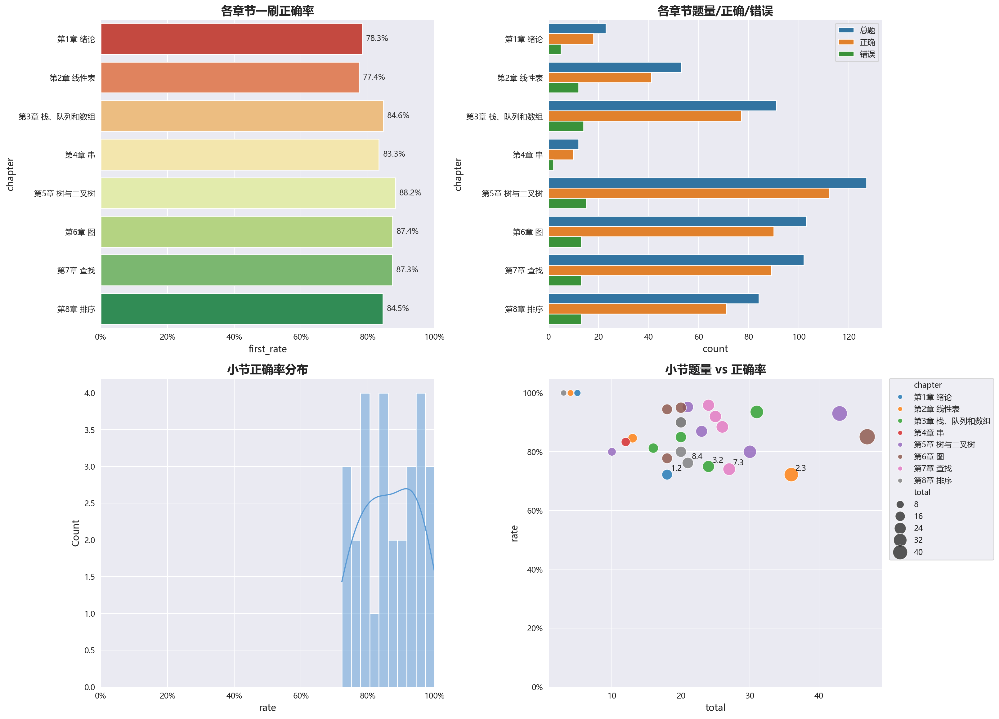

### 章节详情

| 章节 | 题量 | 正确率 | 最弱小节 |
|:---|:---:|:---:|:---|
| 第1章 绪论 | 23 | 78.3% | 1.2 算法和算法评价 (72.2%) |
| 第2章 线性表 | 53 | 77.4% | 2.3 线性表的链式表示 (72.2%) |
| 第3章 栈、队列和数组 | 91 | 84.6% | 3.2 队列 (75.0%) |
| 第4章 串 | 12 | 83.3% | 4.2 串的模式匹配 (83.3%) |
| 第5章 树与二叉树 | 127 | 88.2% | 5.2 二叉树的概念 (80.0%) |
| 第6章 图 | 103 | 87.4% | 6.3 图的遍历 (77.8%) |
| 第7章 查找 | 102 | 87.3% | 7.3 树形查找 (74.1%) |
| 第8章 排序 | 84 | 84.5% | 8.4 选择排序 (76.2%) |
> 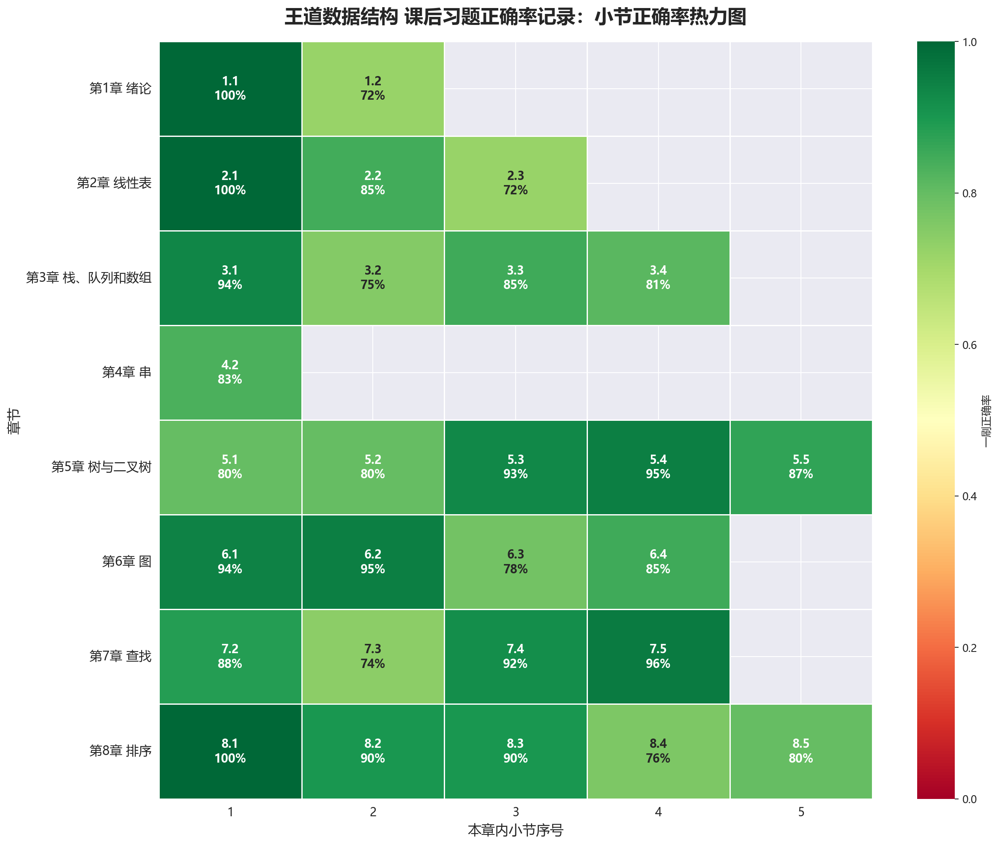

### 薄弱小节（< 70%，共 0 个）

**无** — 全部小节正确率 >= 70%

### 掌握牢固（>= 90%，共 12 个）

1.1 数据结构的基本概念 (5/5)、2.1 线性表的定义和基本操作 (4/4)、8.1 排序的基本概念 (3/3)、7.5 散列(Hash)表 (23/24)、5.4 树、森林 (20/21)、6.2 图的存储及基本操作 (19/20)、6.1 图的基本概念 (17/18)、3.1 栈 (29/31)

## 四、计算机组成原理（73.8%）

题量：592 | 正确：437 | 章节：7 | 小节：26

> 详细数据与图表见 `分析结果/03_王道计算机组成原理/`

> 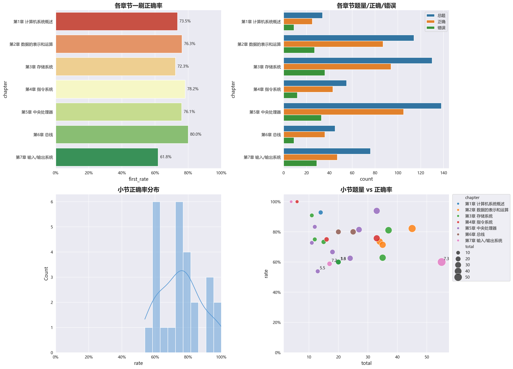

### 章节详情

| 章节 | 题量 | 正确率 | 最弱小节 |
|:---|:---:|:---:|:---|
| 第1章 计算机系统概述 | 34 | 73.5% | 1.3 计算机的性能指标 (60.0%) |
| 第2章 数据的表示和运算 | 114 | 76.3% | 2.2 运算方法和运算电路 (71.4%) |
| 第3章 存储系统 | 130 | 72.3% | 3.6 虚拟存储器 (60.0%) |
| 第4章 指令系统 | 55 | 78.2% | 4.1 指令系统 (75.0%) |
| 第5章 中央处理器 | 138 | 76.1% | 5.5 异常和中断机制 (53.8%) |
| 第6章 总线 | 45 | 80.0% | 6.1 总线概述 (80.0%) |
| 第7章 输入/输出系统 | 76 | 61.8% | 7.2 I/O接口 (58.8%) |
> 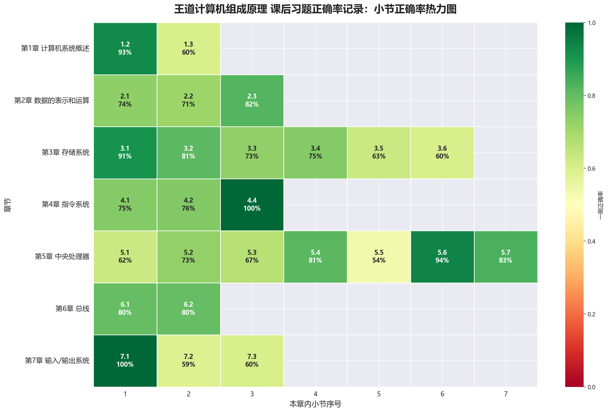

### 薄弱小节（< 70%，共 8 个）

| 小节 | 正确率 | 建议 |
|:---|:---:|:---|
| 5.5 异常和中断机制 | 53.8% (7/13) | **优先二刷** |
| 7.2 I/O接口 | 58.8% (10/17) | 重点回顾 |
| 1.3 计算机的性能指标 | 60.0% (12/20) | 重点回顾 |
| 3.6 虚拟存储器 | 60.0% (12/20) | 重点回顾 |
| 7.3 I/O方式 | 60.0% (33/55) | 重点回顾 |
| 5.1 CPU的功能和基本结构 | 62.5% (15/24) | 重点回顾 |
| 3.5 高速缓冲存储器 | 62.9% (22/35) | 重点回顾 |
| 5.3 数据通路的功能和基本结构 | 66.7% (12/18) | 查漏补缺 |

### 掌握牢固（>= 90%，共 5 个）

4.4 CISC和RISC的基本概念 (6/6)、7.1 I/O系统基本概念 (4/4)、5.6 指令流水线 (31/33)、1.2 计算机系统层次结构 (13/14)、3.1 存储器概述 (10/11)

## 五、操作系统（74.5%）

题量：650 | 正确：484 | 章节：5 | 小节：16

> 详细数据与图表见 `分析结果/02_王道操作系统/`

> 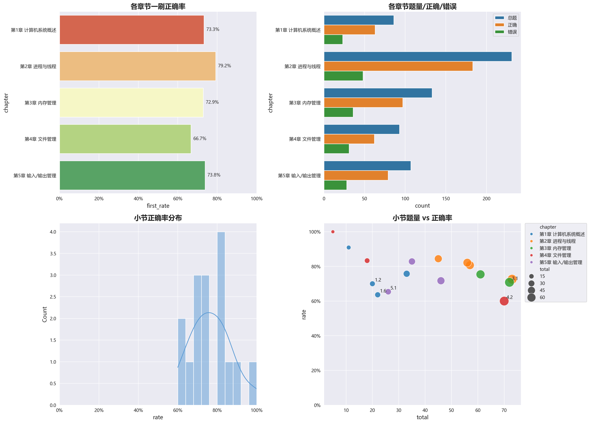

### 章节详情

| 章节 | 题量 | 正确率 | 最弱小节 |
|:---|:---:|:---:|:---|
| 第1章 计算机系统概述 | 86 | 73.3% | 1.6 虚拟机 (63.6%) |
| 第2章 进程与线程 | 231 | 79.2% | 2.1 进程与线程简介 (72.6%) |
| 第3章 内存管理 | 133 | 72.9% | 3.1 内存管理概念 (70.8%) |
| 第4章 文件管理 | 93 | 66.7% | 4.2 目录与文件 (60.0%) |
| 第5章 输入/输出管理 | 107 | 73.8% | 5.1 I/O管理概述 (65.4%) |
> 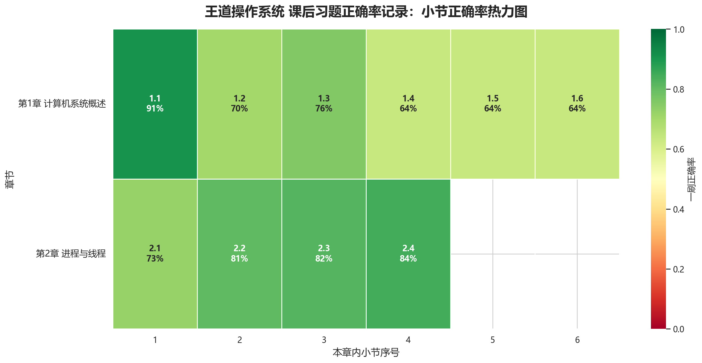

### 薄弱小节（< 70%，共 3 个）

| 小节 | 正确率 | 建议 |
|:---|:---:|:---|
| 4.2 目录与文件 | 60.0% (42/70) | 重点回顾 |
| 1.6 虚拟机 | 63.6% (14/22) | 重点回顾 |
| 5.1 I/O管理概述 | 65.4% (17/26) | 查漏补缺 |

### 掌握牢固（>= 90%，共 2 个）

4.1 文件系统基础 (5/5)、1.1 操作系统的基本概念 (10/11)

## 六、深度分析

### 6.1 错题绝对量 vs 正确率

正确率相同时，错题量决定优先级。例如 CO I/O 方式错 22 题（55 题中），比中断错 6 题更需要时间投入。

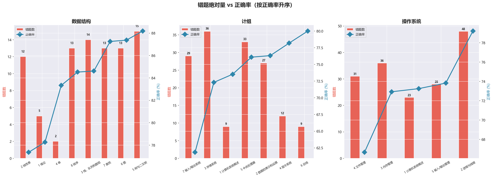

### 6.2 题量-正确率象限图

章节分布在四个象限中。**高题量+低正确率**（右上象限偏下）是最大风险区。

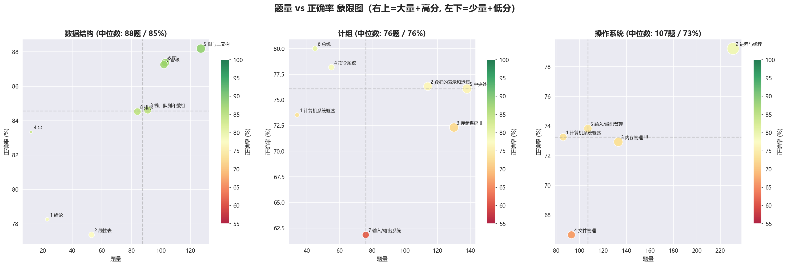

**关键发现**：
- **CO 存储系统(130 题/72%)、CO 中央处理器(138 题/76%)** — 题量大且正确率偏低，是拉低总分的主因
- OS 进程管理(231 题/79%) — 题量最大但正确率尚可，维持即可
- DS 树(127 题/88%) — 大章节+高分，最稳定

### 6.3 跨科关联：CO vs OS 重叠知识点

408 命题常跨科综合。同一知识点在两科的正确率差异能揭示"知识盲区"还是"单科表述问题"。

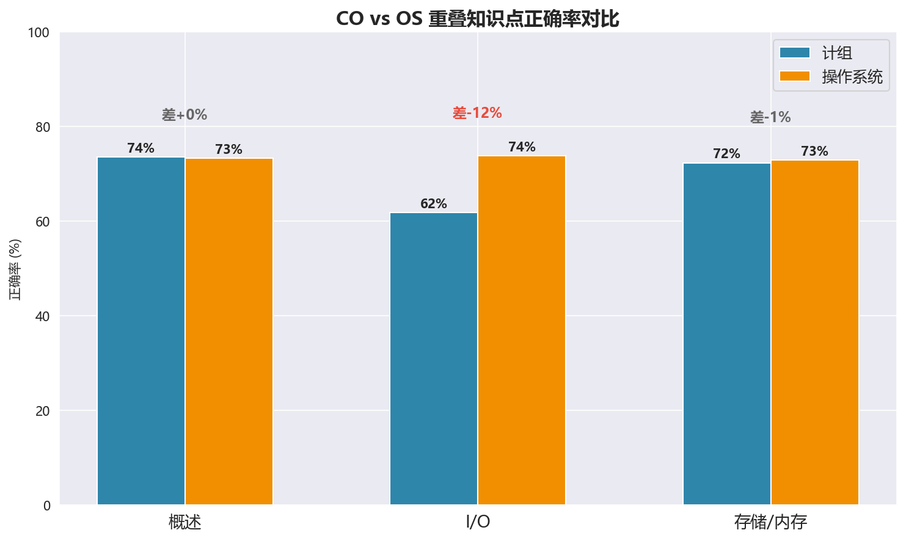

**解读**：
- **I/O**：CO 62% vs OS 74% — 差 12pp，问题在计组的硬件层面
- **概述**：CO 74% vs OS 73% — 一致，说明基础概念掌握均匀
- **存储/内存**：CO 72% vs OS 73% — 几乎一致，但都未达 80%

### 6.4 目标差距量化（408 目标 125 分 → 每科 83%）

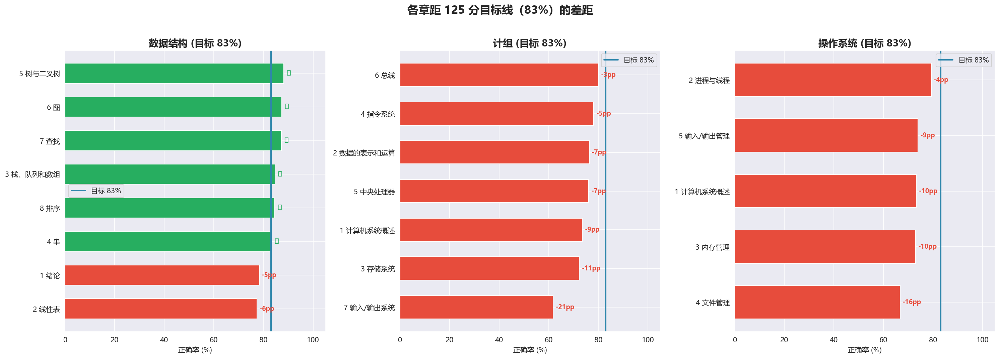

| 科目  |  当前   |  距目标   | 需多对题数 |
| :-- | :---: | :----: | :---: |
| DS  | 85.4% | ✓ 已达标  |   0   |
| CO  | 73.8% | -9.2pp | ~54 题 |
| OS  | 74.5% | -8.5pp | ~55 题 |

### 6.5 真题-自编差距显著性

差距 >15pp 表示真题和自编考察角度差异大，需分别训练。

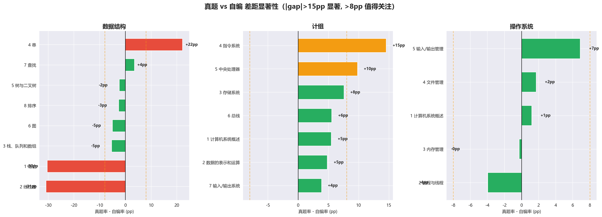

**显著差距（需分别训练）**：
- **DS 第1章绪论(30pp)、第2章线性表(31pp)** — 自编远强于真题，真题角度更刁钻
- **CO 第4章指令系统(15pp)** — 真题强于自编，真题思路已掌握

## 七、总结与建议

### 当前状态

| 指标 | 数值 |
|:---|:---|
| 三科合计 | 1429/1837 = 77.8% |
| 408 估分 | ~117 / 150 |
| 已完成 | 3/4 科（DS/CO/OS） |
| DS 薄弱小节 | 0 个 |
| CO 薄弱小节 | 8 个 |
| OS 薄弱小节 | 3 个 |

### 优势

- **DS 85.4%**：树/图/查找/排序均 85%+，0 个薄弱小节
- CO 指令系统(78%)和总线(80%)达到良好水平
- OS 进程管理(79%)题量最大但正确率稳定

### 短板与对策

| 短板 | 当前 | 目标 | 对策 |
|:---|:---:|:---:|:---|
| CO I/O 系统 | 61.8% | 75% | 中断+DMA+接口，3 小节全 < 70% |
| CO 存储系统 | 72.3% | 80% | Cache+虚拟存储是 408 大题核心 |
| OS 文件管理 | 66.7% | 78% | 目录结构+文件分配，70 题 |
| 计网 | 未开始 | 70% | M 三步法：理解→分层→复盘 |

### 下一步行动

1. **计网开课** — 最后一块拼图，概念密集型

2. **CO I/O 二刷** — 仅 3 小节 76 题，2-3 天可完成

3. **OS 文件管理** — 70 题，与 I/O 穿插进行

4. **DS 维持** — 隔天 5-10 题保持手感

### 输出文件

| 文件 | 内容 |
|:---|:---|
| `408分析报告.md` | 本报告 |
| `分析结果/04_王道数据结构/` | 数据结构 详细（CSV + 图表） |
| `分析结果/03_王道计算机组成原理/` | 计算机组成原理 详细（CSV + 图表） |
| `分析结果/02_王道操作系统/` | 操作系统 详细（CSV + 图表） |
| `分析结果/_汇总/` | 四科横向对比 |