# 408 第一阶段分析报告

> 数据管道: 习题册.xlsx → export_xlsx_to_csv.py → analyze_csv_folder.py → visualize_408.py
> 
> 生成时间：2026-07-03 | 一刷全部完成

---

## 附：408 试卷结构

| 科目 | 总分 | 选择题（2分×N） | 大题 | 
|:---|:---:|:---|:---|
| 数据结构 | **45** | 1--11 (22分) | 41(10分) + 42(15分) |
| 计算机组成原理 | **45** | 12--22 (22分) | 43(8分) + 44(13分) |
| 操作系统 | **35** | 23--32 (20分) | 45(7分) + 46(8分) |
| 计算机网络 | **25** | 33--40 (16分) | 47(9分) |

DS + CO 合计 90 分（60%），是复习重中之重。

### 一刷分数按试卷结构映射

| 科目     |   满分    | 选择(分)  | 大题(分)  |   预估选择    |   预估大题    |   预估总分   | 备注                         |
| :----- | :-----: | :----: | :----: | :-------: | :-------: | :------: | :------------------------- |
| DS     |   45    |   22   |   23   |   20/22   |   18/23   | **~38**  | 选择题稳，大题有算法设计风险             |
| CO     |   45    |   22   |   21   |   18/22   |   12/21   | **~30**  | 大题估计保守——大题正确率通常比选择题低 10pp+ |
| OS     |   35    |   20   |   15   |   15/20   |   10/15   | **~25**  | PV题和大题经验少                  |
| CN     |   25    |   16   |   9    |   14/16   |    6/9    | **~20**  | 大题只有 1 题 9 分，一刷未练过大题       |
| **合计** | **150** | **80** | **70** | **67/80** | **46/70** | **~113** |                            |

> 一刷等效分约 **113/150**，比之前按正确率直乘的 127 更贴近现实——大题正确率通常比选择题低 5-15pp。CN 的大题（9 分）是一刷完全没碰的题型。

### 分科目 ROI（投入产出比）

| 优先级 | 科目  | 满分  | 当前  |   提分空间   | 原因                   |     |
| :-: | :-- | :-: | :-: | :------: | :------------------- | --- |
| P0  | CO  | 45  | ~30 | **+6-8** | 满分高 + 弱点多 + I/O整章可抢救 |     |
| P0  | DS  | 45  | ~38 |   +2-3   | 已到天花板，维持即可           |     |
| P1  | OS  | 35  | ~25 | **+3-5** | 文件管理 + PV题专项         |     |
| P2  | CN  | 25  | ~20 |   +1-2   | 满分最低，提升绝对值有限         |     |

**CO 既是满分最高（45）又是当前最弱（~30）——提分空间最大。** 408 强化二刷应该以 CO I/O + 存储系统为首要目标。

---

## 一、四科总览

| 科目          |    题量    |   正确数    |    正确率    |  真题率  |  自编率  |    一刷等效分     |
| :---------- | :------: | :------: | :-------: | :---: | :---: | :----------: |
| **数据结构**    |   595    |   508    | **85.4%** | 83.0% | 86.3% |    ~34/40    |
| **计算机网络**   |   561    |   457    | **81.5%** | 82.4% | 81.2% |    ~33/40    |
| **操作系统**    |   650    |   484    |   74.5%   | 74.3% | 74.5% |    ~30/40    |
| **计算机组成原理** |   592    |   437    |   73.8%   | 78.6% | 71.6% |    ~30/40    |
| **合计**      | **2398** | **1886** | **78.6%** |       |       | **~127/160** |

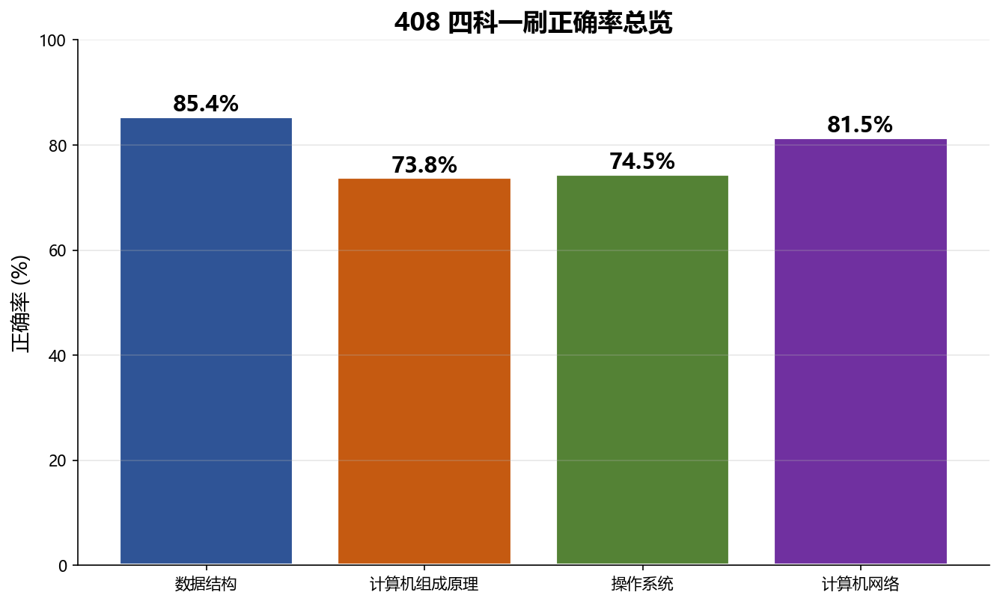

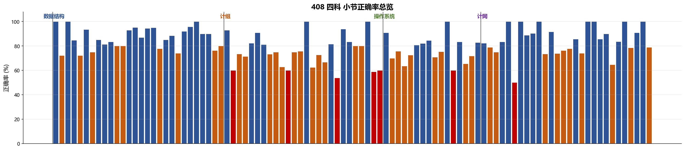

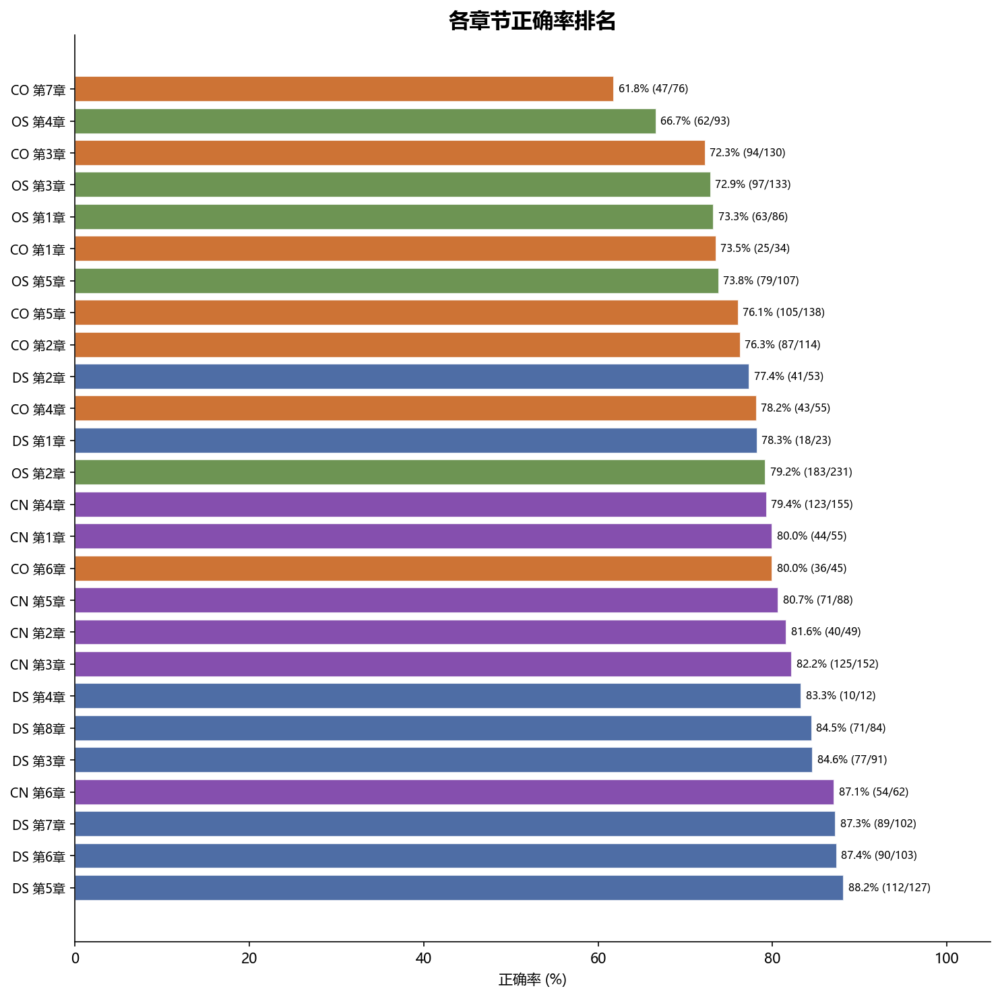

---

## 二、真题 vs 自编 对比

| 科目  | 真题正确率 | 自编正确率 |   差值   | 解读            |
| :-- | :---: | :---: | :----: | :------------ |
| DS  | 83.0% | 86.3% | -3.3pp | 自编偏简单，真题更活    |
| CN  | 82.4% | 81.2% | +1.2pp | 真题自编均衡，理解到位   |
| OS  | 74.3% | 74.5% | -0.2pp | 几乎无差，稳定但无亮点   |
| CO  | 78.6% | 71.6% | +7.0pp | 自编远难真题，王道自编偏怪 |

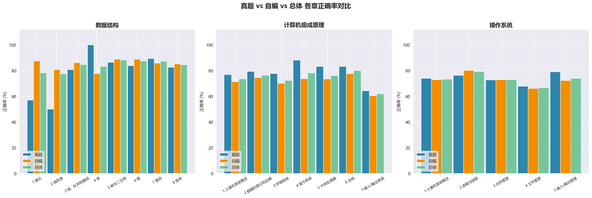

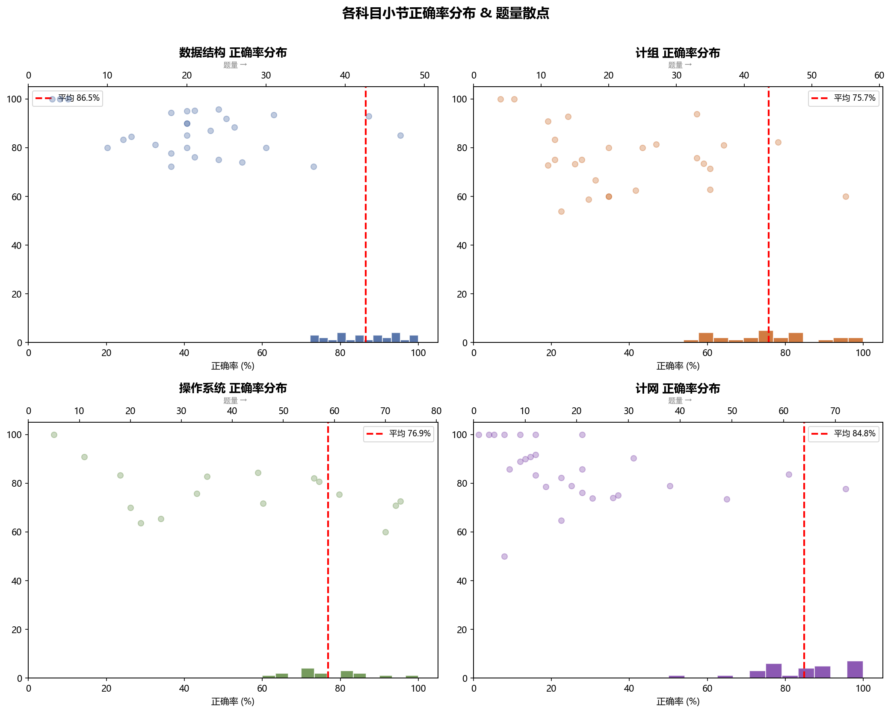

---

## 三、薄弱小节与错题分布

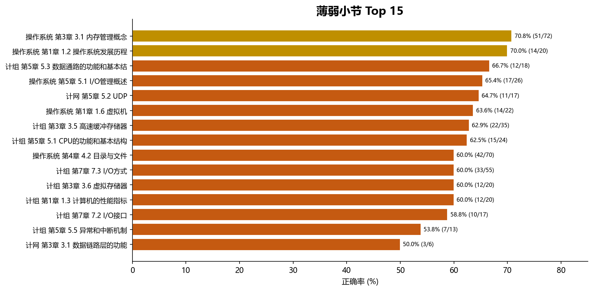

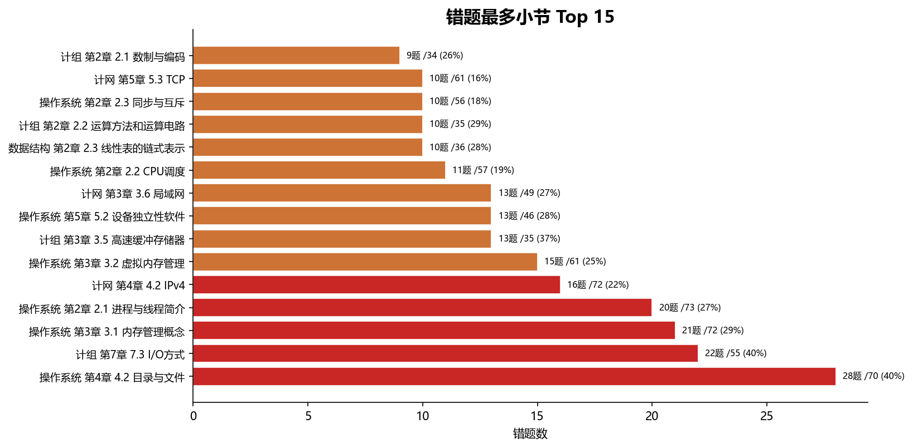

---

## 三、数据结构 (85.4%)

题量 595 | 正确 508 | 已完成 8 章

| 章节 | 题量 | 正确率 | 最弱小节 |
|:---|:---:|:---:|:---|
| 第1章 绪论 | 23 | 78.3% | 1.2 算法评价 (72.2%) |
| 第2章 线性表 | 53 | 77.4% | 2.3 链式表示 (72.2%) |
| 第3章 栈队列数组 | 91 | 84.6% | 3.2 队列 (75.0%) |
| 第5章 树与二叉树 | 127 | 88.2% | 5.1 树基本概念 (80.0%) |
| 第6章 图 | 103 | 87.4% | 6.3 图的遍历 (77.8%) |
| 第7章 查找 | 102 | 87.3% | 7.3 树形查找 (BST/AVL/RBT) |
| 第8章 排序 | 84 | 84.5% | 8.4 选择排序 (76.2%) |

**无低于 70% 的小节**。DS 是压舱石。

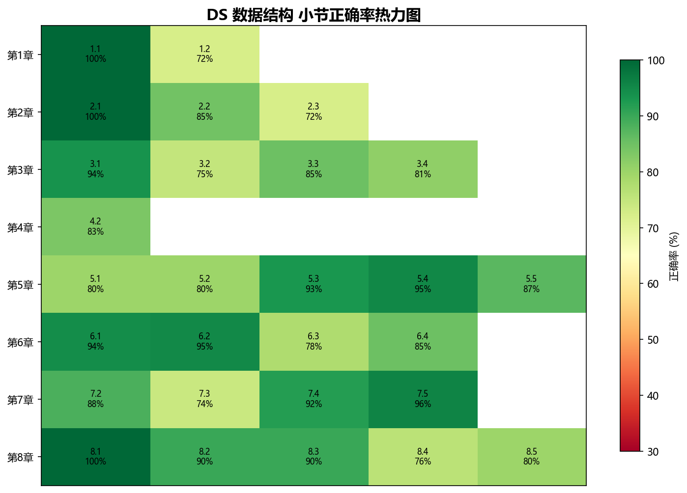

---

## 四、计算机组成原理 (73.8%)

题量 592 | 正确 437 | 四科最低 | **薄弱小节最多（8 个 < 70%）**

| 章节 | 题量 | 正确率 | 最弱小节 |
|:---|:---:|:---:|:---|
| 第1章 概述 | 34 | 73.5% | 1.3 性能指标 (60.0%) |
| 第2章 数据表示 | 114 | 76.3% | 2.2 运算电路 (71.4%) |
| 第3章 存储系统 | 130 | 72.3% | 3.6 虚拟存储器 (60.0%) |
| 第4章 指令系统 | 55 | 78.2% | 4.1 指令系统 (75.0%) |
| 第5章 中央处理器 | 138 | 76.1% | 5.5 中断机制 (**53.8%**) |
| 第6章 总线 | 45 | 80.0% | — |
| 第7章 I/O 系统 | 76 | **61.8%** | 7.2 I/O 接口 (58.8%) |

### CO 薄弱小节清单

| 小节            |  正确率  |
| :------------ | :---: |
| 5.5 异常和中断机制   | 53.8% |
| 7.2 I/O 接口    | 58.8% |
| 3.6 虚拟存储器     | 60.0% |
| 7.3 I/O 方式    | 60.0% |
| 3.5 高速缓冲存储器   | 62.9% |
| 5.1 CPU 功能和结构 | 62.5% |
| 5.3 数据通路      | 66.7% |
| 1.3 性能指标      | 60.0% |

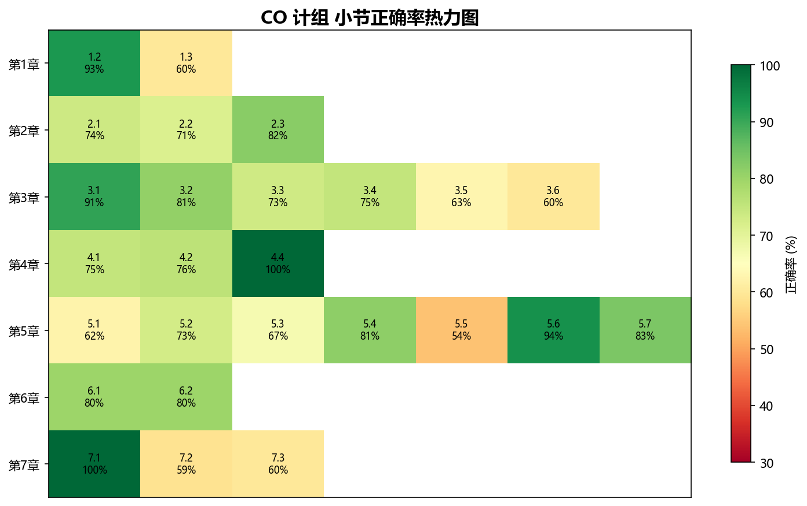

---

## 五、操作系统 (74.5%)

题量 650 | 正确 484

| 章节         | 题量  |    正确率    | 最弱小节                  |
| :--------- | :-: | :-------: | :-------------------- |
| 第1章 概述     | 86  |   73.3%   | 1.6 虚拟机 (63.6%)       |
| 第2章 进程线程   | 231 |   79.2%   | 2.1 进程简介 (72.6%)      |
| 第3章 内存管理   | 133 |   72.9%   | 3.1 内存概念 (70.8%)      |
| 第4章 文件管理   | 93  | **66.7%** | 4.2 目录与文件 (**60.0%**) |
| 第5章 I/O 管理 | 107 |   73.8%   | 5.1 I/O 概述 (65.4%)    |

### OS 薄弱小节

| 小节 | 正确率 |
|:---|:---:|
| 4.2 目录与文件 | 60.0% |
| 1.6 虚拟机 | 63.6% |
| 5.1 I/O 概述 | 65.4% |

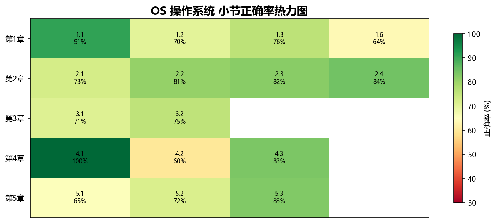

---

## 六、计算机网络 (81.5%)

题量 561 | 正确 457 | 最后开始，最先结束

| 章节        | 题量  |  正确率  | 最弱小节                  |
| :-------- | :-: | :---: | :-------------------- |
| 第1章 体系结构  | 55  | 80.0% | 1.2 参考模型 (78.9%)      |
| 第2章 物理层   | 49  | 81.6% | 2.1 通信基础 (75.0%)      |
| 第3章 数据链路层 | 152 | 82.2% | 3.1 链路层功能 (**50.0%**) |
| 第4章 网络层   | 193 | 83.4% | 4.4 路由协议 (74.1%)      |
| 第5章 传输层   | 73  | 85.0% | —                     |
| 第6章 应用层   | 39  | 75.0% | —                     |

### CN 薄弱小节

| 小节            |  正确率  |
| :------------ | :---: |
| 3.1 数据链路层功能   | 50.0% |
| 3.8 链路层设备     | 73.9% |
| 3.6 局域网       | 73.5% |
| 4.4 路由算法与路由协议 | 74.1% |

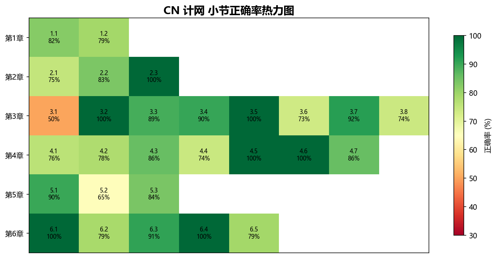

---

## 七、跨科薄弱汇总

| 优先级 | 科目 | 章节 | 正确率 | 行动 |
|:---:|:---|:---|:---:|:---|
| P0 | CO | 5.5 中断机制 | 53.8% | 二刷 + 重新理解 CPU 中断全流程 |
| P0 | CO | 7.2 I/O 接口 | 58.8% | I/O 全链路：接口→中断→DMA |
| P0 | CO | 7.3 I/O 方式 | 60.0% | 程序查询/中断/DMA 对比 |
| P1 | CO | 3.5 Cache | 62.9% | 映射方式+替换算法+写策略 |
| P1 | OS | 4.2 目录与文件 | 60.0% | FCB/索引节点/目录结构/文件分配 |
| P1 | CN | 3.1 链路层功能 | 50.0% | 题量极少(6题)，概念辨析回看书 |
| P2 | CO | 3.6 虚拟存储器 | 60.0% | 页表/MMU/TLB/Cache 联合访存 |
| P2 | CN | 4.4 路由协议 | 74.1% | RIP/OSPF/BGP 对比 |

---

## 八、总结

1. **一刷等效 127/160**，CO 拖后腿最严重（8 个薄弱小节），DS 和 CN 撑着
2. **CO 真题 78.6% > 自编 71.6%**，差 7pp 说明自编确实偏难偏怪——二刷以真题为准，自编错题选择性回顾
3. **CN 81.5%** 超预期，最大的惊喜是第 5 章传输层 85%、第 4 章网络层 83.4%
4. **CP I/O + 中断 + Cache 三个模块**加起来占 CO 薄弱小节的半数，是二刷的首要目标
5. **OS 文件管理 66.7%** 单独看低，但 408 文件管理考得不深，真题为主即可
